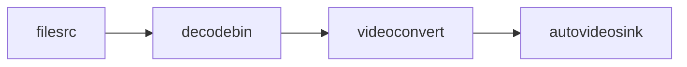
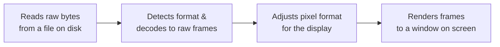
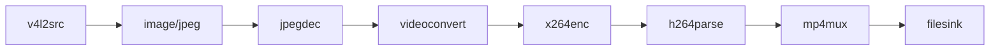
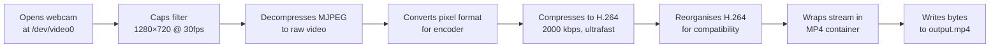

<!-- © 2025 [Supun Akalanka Sriyananda] — CC BY-NC 4.0. Free to share with attribution, not for commercial use. -->

# 01 — What is GStreamer?

GStreamer has its own vocabulary — pipelines, elements, pads, caps — and if you don't have those words pinned down before you start writing code, the error messages you'll hit later will seem completely impenetrable. So let's deal with the concepts first. Nothing to install or run yet. Get these four ideas solid and the rest of the tutorial will make sense.

---

## The Core Idea: A Production Line for Data

GStreamer is a multimedia framework. Its job is to move media data — video frames, audio samples, or both — through a series of processing steps, from a source (like a camera) to a destination (like a file or a network socket).

The best mental model is a **production line in a factory**. Raw material enters at one end of the conveyor belt. As it passes through each station, a worker transforms it — cuts it, shapes it, packages it. The finished product emerges at the other end. In GStreamer:

- The **conveyor belt** is the pipeline itself — the overall structure that holds everything together and moves data through it.
- Each **worker station** is called an **element** — a single processing step that does one specific thing.
- The **raw material** is media data, and the **finished product** depends on what elements you chose.
- The **connections between stations** are called **pad links** — the handshakes that let data pass from one element to the next.

A simple pipeline that reads a video from a file and plays it on screen might look like this:





Left to right: `filesrc` reads raw bytes from a file. `decodebin` automatically detects the video format and decodes the compressed data into raw video frames. `videoconvert` adjusts the pixel format to whatever the display expects. `autovideosink` renders each frame to a window on screen.

In GStreamer notation, the `!` character represents a link between elements, so the pipeline above is written as:

```
filesrc location=video.mp4 ! decodebin ! videoconvert ! autovideosink
```

You'll see this `!`-separated notation constantly. It's GStreamer's way of expressing a production line in a single readable string.

---

## Elements: The Workers

Every processing step in GStreamer is an **element**. Each element has a name, accepts some kind of input data, does one thing to it, and produces some kind of output data. GStreamer ships with hundreds of built-in elements covering almost every conceivable multimedia operation.

There are three broad categories:

**Source elements** produce data. They have no input — data originates inside them. `v4l2src` reads video frames from a camera device. `filesrc` reads bytes from a file. `audiotestsrc` generates a synthetic audio tone. Sources are always the left-most element in a pipeline.

**Filter elements** (also called transform elements) take data in, process it, and pass it on. `videoconvert` converts between pixel formats. `x264enc` compresses raw video frames into H.264. `jpegdec` decompresses JPEG images into raw frames. Most elements fall into this category.

**Sink elements** consume data. They have no output — data ends inside them. `filesink` writes bytes to a file. `autovideosink` displays frames on screen. `fakesink` discards everything silently (useful for testing). Sinks are always the right-most element in a pipeline.

A valid pipeline always starts with a source, ends with a sink, and has zero or more filters in between.

---

## Pads: The Connection Points

If elements are worker stations, **pads** are the hands they use to pass data to each other. Every element exposes one or more pads, and data flows through linked pairs of pads.

A **source pad** (abbreviated "src pad") is where data comes *out* of an element. Despite the confusingly similar name, a source pad is not the same as a source element — any element can have source pads. Think of it as an element's output hand.

A **sink pad** is where data goes *into* an element. Again, any element can have sink pads. Think of it as an element's input hand.

When you write `elementA ! elementB`, GStreamer automatically links the source pad of `elementA` to the sink pad of `elementB`. For simple elements with exactly one input and one output, this automatic linking is all you ever need.

Some elements have multiple pads. `mp4mux`, for example, has separate sink pads for video and audio — because it needs both streams to combine them into a single MP4 file. When elements have multiple pads, you sometimes need to specify which pad to connect to, but you won't need to worry about that in this tutorial.

---

## Caps: The Format Negotiation

This is where Python developers often get their first GStreamer confusion, so read this section carefully.

Imagine two worker stations on a production line. Station A outputs metal sheets. Station B is a press that can only handle sheets up to 30cm wide. If A is producing 50cm sheets, there's a problem. Before any work starts, the factory manager negotiates: "Station A, can you cut your sheets to 30cm? Great, then we can link you to B."

In GStreamer, this format negotiation is handled through **caps** (short for capabilities). Caps describe the format of the data flowing through a pad: things like video resolution, frame rate, and pixel format (how colour values are stored in memory). Every pad has caps that describe what formats it can accept or produce.

When you link two elements together, GStreamer performs **caps negotiation** — it finds a format that both elements can agree on. If the source pad of element A says "I can produce 1280×720 or 1920×1080 video" and the sink pad of element B says "I can accept 640×480 or 1280×720 video", negotiation succeeds at 1280×720, because that's the common ground.

If there's no common ground — if element A can't produce any format that element B can accept — negotiation fails and you get an error like "could not link" or "failed to negotiate". This is one of the most common GStreamer errors beginners hit.

You can also insert a **caps filter** into the pipeline to make format requirements explicit and prevent ambiguity. A caps filter looks like:

```
! video/x-raw,width=1280,height=720,framerate=30/1 !
```

This is not an element — it's a constraint. It tells GStreamer: "the data flowing through this point must be raw video, 1280×720, at 30 frames per second." If negotiation would otherwise produce a different format, the caps filter forces the issue. If that's impossible, the pipeline fails to start — which is actually useful, because it tells you early that something is misconfigured rather than letting the pipeline run silently with the wrong format.

---

## Putting it Together: Reading a Pipeline String

With that vocabulary in hand, here's the software-encoded pipeline from later in this tutorial:





Left to right: `v4l2src` opens the webcam at `/dev/video0` and starts producing frames. The caps filter `image/jpeg,...` constrains the camera to deliver MJPEG frames at 1280×720 at 30fps — most modern webcams produce MJPEG rather than raw video because it's more efficient over USB. `jpegdec` decompresses each MJPEG frame into raw video. `videoconvert` converts the raw frame to whatever pixel format `x264enc` expects. `x264enc` compresses to H.264, using the `ultrafast` preset for low latency and a target bitrate of 2000 kbps. `h264parse` reads the H.264 stream and reorganises it slightly for downstream compatibility. `mp4mux` wraps it in an MP4 container — the metadata structure that makes it a proper file a media player can open. Finally, `filesink` writes the bytes to disk.

Every step is necessary. Every `!` is a pad link. Every `key=value` pair after an element name is a property being set on that element. Once you can read a pipeline string like this and understand the role of each component, we're ready to start building our own.

**Next: [02 — Installation and Setup](02-installation-and-setup.md)**
