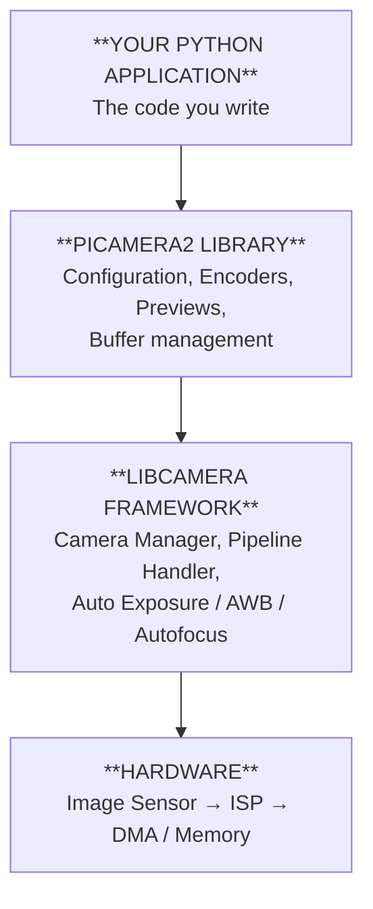

<!-- © 2025 [Supun Akalanka Sriyananda] — CC BY-NC 4.0. Free to share with attribution, not for commercial use. -->

# 03 — Picamera2 Architecture

You don't need to understand Picamera2's architecture to take photos — but it's the kind of knowledge that stops you being confused when something doesn't work as expected, and that opens up advanced capabilities when you're ready for them. This document walks through every layer of the system, from your Python code at the top down to the physical sensor at the bottom.

---

## The Big Picture — A Layered System

The camera system on a Raspberry Pi is built in distinct layers, each with a clear responsibility. Think of it like an onion: your code sits on the outside, and every layer beneath handles something more specific and lower-level. When you call `picam2.capture_file()`, that call travels down through all of these layers before any hardware is touched, and the resulting image data travels all the way back up.



---

## Layer 1: Your Application Code

At the top is your Python program. You interact with everything through a single entry point: the `Picamera2` class. This class is designed as a **facade** — a software pattern that provides one simple interface to a complex system. From the outside, you call `start()`, `capture_file()`, and `stop()`. What those three calls trigger internally, across multiple threads and hardware subsystems, is substantial. The facade hides that complexity so you can focus on what you're building.

---

## Layer 2: The Picamera2 Library

The Picamera2 library translates the Python-friendly interface into lower-level camera operations. It has four major subsystems.

### The Configuration System

Configuration is how you tell the camera what mode to operate in before you start it. Think of it as choosing the right tool for the job — you configure for stills when you want maximum quality, for video when you need frame rate, for preview when you need low latency.

When you call `create_still_configuration()`, Picamera2 builds a `CameraConfiguration` object describing the full pipeline setup: what resolution to use, what format the image data should be in, how many memory buffers to allocate, and which sensor mode to request. Here's a simplified look at what that object contains:

```python
# What create_still_configuration() returns (simplified)
{
    "main": {          # The primary output stream
        "size": (4608, 2592),      # Full sensor resolution
        "format": "XBGR8888"       # Pixel format
    },
    "lores": None,     # Optional low-resolution stream (disabled by default)
    "raw": None,       # Optional raw Bayer data stream (disabled by default)
    "transform": Transform(hflip=False, vflip=False),
    "colour_space": ColorSpace.Sycc(),
    "buffer_count": 1
}
```

You can modify any of these values before calling `configure()`. For example, if you want to capture a thumbnail alongside your full-resolution image in a single request:

```python
config = picam2.create_still_configuration(
    main={"size": (4608, 2592)},
    lores={"size": (640, 480)}   # Enable the low-res stream
)
picam2.configure(config)
```

The three configuration types optimise for different things: `create_still_configuration()` maximises quality by choosing the highest-resolution sensor mode and applying strong noise reduction; `create_video_configuration()` maximises throughput by choosing a sensor mode that delivers high frame rates with lower overhead; and `create_preview_configuration()` minimises latency for real-time display.

### The Control System

If configuration is choosing the right tool, controls are adjusting that tool while you're using it. Controls affect the image signal processor's behaviour in real time and can be changed at any moment. The full list of available controls on your specific camera can be queried with `picam2.camera_controls`, but the most commonly used ones are:

| Control | Type | Range | What it does |
|---------|------|-------|--------------|
| `Brightness` | float | -1.0 → 1.0 | Post-processing brightness offset |
| `Contrast` | float | 0.0 → 32.0 | Shadow/highlight spread |
| `Saturation` | float | 0.0 → 32.0 | Colour vividness |
| `ExposureTime` | int (µs) | varies | Sensor integration time (overrides AE) |
| `AnalogueGain` | float | varies | Sensor amplification (like ISO) |
| `AwbMode` | int | enum | Auto white balance mode |
| `AfMode` | int | enum | Autofocus mode (Module 3 only) |
| `Sharpness` | float | 0.0 → 16.0 | Edge sharpening strength |
| `NoiseReductionMode` | int | enum | How aggressively noise is reduced |
| `ColourGains` | tuple | varies | Manual red/blue gains (overrides AWB) |

### The Capture Methods

The capture methods are your bridge between the live camera stream and your application. Knowing the difference between them saves a lot of confusion.

`capture_file(filename)` grabs a frame, encodes it based on the file extension you provide (`.jpg`, `.png`, etc.), and writes it to disk. One line, just works.

`capture_array()` returns the current frame as a numpy array in memory. Use this for any kind of image analysis, computer vision, or real-time processing — anything where you want to *look at* the image in Python rather than just *save* it.

`capture_buffer()` returns the raw memory buffer in its native format, before any conversion to a numpy array. Useful for maximum-performance pipelines where even the numpy conversion overhead matters, though most users will use `capture_array()` instead.

`capture_metadata()` returns information *about* the last frame without returning the image itself. The metadata includes the actual exposure time used, the analogue gain, the colour gains applied by AWB, the focus position, and more. Very useful for debugging (why does my image look wrong?) and logging (what settings did the camera actually use?).

`capture_request()` is the lowest-level method, giving you direct access to a `CompletedRequest` object containing all active streams simultaneously. Use this when you need to grab a high-res main image and a low-res thumbnail in the same instant, or when you need raw Bayer data alongside the processed image.

### Streams, Encoders, and Previews

When the camera is running, it continuously produces frames — typically somewhere between 15 and 120 frames per second depending on the mode. Picamera2 manages where those frames go through a stream-based architecture. You can have multiple streams active simultaneously:

The **main stream** is the primary output at your configured resolution. The **lores stream** is an optional low-resolution copy of the same frames, useful when you want to run fast image analysis on small frames while also recording high-resolution stills. The **raw stream** gives you the unprocessed Bayer sensor data, useful for custom ISP pipelines or scientific applications.

**Encoders** consume a stream and compress it into a video format. `H264Encoder` produces efficient H.264 video. `MJPEGEncoder` produces Motion JPEG — a sequence of JPEG frames in a single file, simpler but less efficient. When you call `start_encoder(encoder, output)`, the encoder runs in its own thread, continuously pulling frames from the specified stream and writing compressed data to the output.

**Previews** are live display windows. `QtPreview` creates a window using the Qt framework, which works well on systems with a desktop environment. `DrmPreview` renders directly to the display hardware, bypassing the window system — the option for headless embedded systems. `NullPreview` does nothing, used when you want Picamera2's preview infrastructure to exist without actually displaying anything.

---

## Layer 3: The libcamera Framework

Below Picamera2 sits libcamera, the modern Linux camera stack that replaced the older MMAL/V4L2 system. You don't interact with libcamera directly in most applications — Picamera2 handles that — but understanding what libcamera does explains why some things work the way they do.

The **Camera Manager** discovers all cameras connected to the system at boot time and enforces exclusive access — only one application can have a camera open at a time. When you create a `Picamera2()` object, it requests a camera from the Camera Manager, which grants access if nothing else is currently using it.

The **Pipeline Handler** configures the complete image processing chain for a specific hardware platform. On a Raspberry Pi, the pipeline involves the camera sensor, the ISP (which lives in the GPU), DMA controllers for moving image data efficiently between hardware components, and output buffers that your application can read. The pipeline handler knows the specific capabilities and quirks of the Raspberry Pi hardware and sets everything up according to your configuration.

The **image processing algorithms** run continuously in the background while the camera is streaming. Auto-Exposure (AE) analyses each frame's brightness and adjusts exposure time and gain to keep the image properly exposed. Auto White Balance (AWB) samples the colour distribution of the scene and applies corrections so white objects appear neutral under any lighting. Auto Focus (AF), if your camera module supports it, continuously adjusts the lens to maximise sharpness. These algorithms are the reason you need that two-second warm-up period — they're running iteratively and need several frames of data before they converge on accurate settings.

---

## Layer 4: The Hardware

At the bottom is the physical hardware.

The **image sensor** converts light into electrical signals. On the Camera Module 3, this is the IMX708 from Sony. Light enters through the lens, hits the sensor surface, and the photoelectric cells generate electrical charges proportional to the amount of light received. These are read out as raw digital values in the **Bayer pattern** — a grid where each position records only red, green, or blue light. Human eyes are more sensitive to green, so the Bayer pattern has twice as many green pixels as red or blue.

The **ISP (Image Signal Processor)** takes that raw Bayer data and transforms it into the finished colour image. This is a multi-stage process: **demosaicing** (reconstructing full colour at every pixel by interpolating from surrounding Bayer cells), **colour space conversion**, **scaling** (resizing to your requested output resolution), **noise reduction**, and **sharpening**. All of this happens in dedicated hardware rather than software, which is why it can process 12-megapixel frames at 14 frames per second without overloading the CPU.

The **DMA (Direct Memory Access) controllers** move image data between hardware components without involving the CPU. Once the ISP finishes processing a frame, the DMA controller moves it into a memory buffer your application can read — efficiently, without the CPU ever having to copy those large image buffers manually.

---

## The Four Major Usage Patterns

With the architecture clear, here are the four patterns you'll encounter most in real applications:

**Pattern 1: Simple Still Capture** — Start the camera, wait for auto-exposure to settle, grab a frame, save it, stop. The frame travels from the sensor through the ISP into the main stream buffer, then `capture_file()` reads that buffer and encodes it to JPEG.

**Pattern 2: Video Recording** — Create a video configuration, start an encoder alongside the camera, let it run, then stop the encoder and the camera. The encoder runs in a background thread, continuously reading frames from the encode stream and writing compressed data to a file.

**Pattern 3: Computer Vision with Preview** — Create a preview configuration with a main stream for processing and a display stream for the live feed. Your code reads from the main stream with `capture_array()` in a loop, while the preview window updates from the display stream in parallel, in different threads.

**Pattern 4: Multi-Stream Capture** — Use `capture_request()` to grab a single `CompletedRequest` containing all active streams at the same instant. Pull a high-resolution array from the main stream and a low-resolution array from the lores stream simultaneously, ensuring they represent exactly the same moment in time.

---

## The Class Hierarchy

For those who want to understand the object-oriented structure:

```
object (Python base class)
│
├── Picamera2                    ← The main class you use directly
│
├── Preview (Abstract Base)
│   ├── QtPreview
│   │   └── QtGlPreview          ← Qt with OpenGL acceleration
│   ├── DrmPreview               ← Headless / embedded systems
│   └── NullPreview              ← No display (testing / CI)
│
├── Encoder (Abstract Base)
│   ├── H264Encoder              ← Efficient video recording
│   ├── MJPEGEncoder             ← Motion JPEG recording
│   └── JpegEncoder              ← Still image encoding
│
├── Output (Abstract Base)
│   ├── FileOutput               ← Write to disk
│   ├── FfmpegOutput             ← Pipe through FFmpeg
│   └── CircularOutput           ← Ring-buffer (e.g. dashcam style)
│
├── CameraConfiguration          ← Dictionary-like config object
├── StreamConfiguration          ← Per-stream settings (libcamera binding)
├── Transform                    ← Flip/rotation data class
├── CompletedRequest             ← Wrapper around a captured libcamera request
└── Metadata                     ← Dictionary subclass for capture metadata
```

Abstract base classes (Preview, Encoder, Output) define a common interface that all subclasses must implement. This is what allows Picamera2 to treat `H264Encoder` and `MJPEGEncoder` interchangeably — they both implement the same encoder interface, just with different compression algorithms underneath.

---

## Key Design Insight: Everything Is a Stream

The single most important concept in the Picamera2 architecture is that **the camera is always streaming frames**, and different parts of your application consume those frames in different ways. Once you see this, a lot of the API design makes immediate sense.

`capture_file()` consumes one frame from the main stream and saves it. `capture_array()` consumes one frame from the main stream and gives it to your Python code. An encoder continuously consumes every frame from the encode stream and compresses them. A preview continuously consumes every frame from the display stream and renders them. Multiple consumers can be active simultaneously, each getting a copy of the same frames from their respective stream.

This stream-centric design is why the camera can be recording video, showing a live preview, and letting you grab numpy arrays for analysis — all at exactly the same time.

**Next: [04 — Practical Projects](04-projects.md)**
